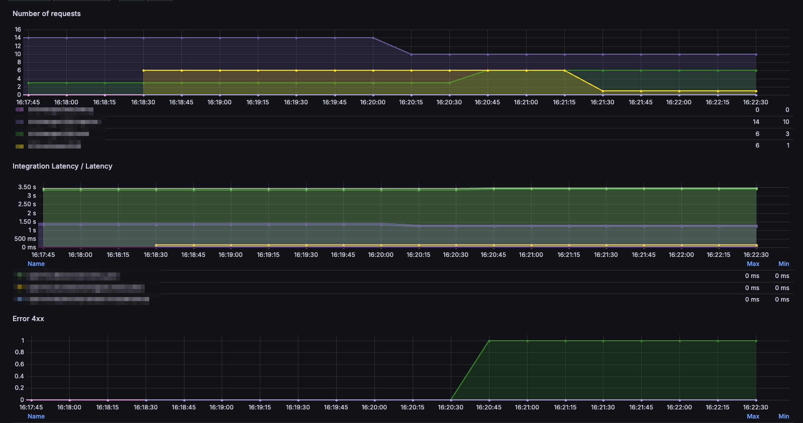
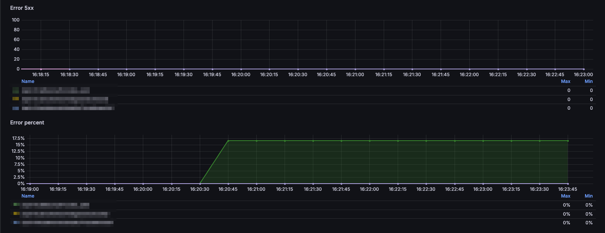

# Metrics Exporter for AWS API Gateway v2 

This script fetches API Gateway metrics from AWS CloudWatch and exposes them via a Prometheus HTTP server for monitoring. It uses the `boto3` AWS SDK to interact with AWS CloudWatch and `prometheus_client` to serve the metrics.

The script continuously retrieves the latest API Gateway metrics at regular intervals (configured by the user) and exposes them through a local HTTP server for Prometheus scraping.

## Configuration

The following environment variables are used to configure the behavior of the script:

- `AWS_REGION` (default: `us-east-1`)  
  The AWS region where the API Gateway is located. If not set, the default region is `us-east-1`.

- `API_ID` (required)  
  The unique ID of the API Gateway for which metrics are to be fetched. This is a **required** environment variable.

- `API_STAGE` (default: `$default`)  
  The stage of the API Gateway. If not set, the default stage is `$default`.

- `REFRESH_INTERVAL` (default: `60`)  
  The time interval (in seconds) between metric refreshes. This defines how often the script fetches and updates metrics.

- `PORT` (default: `8200`)  
  The port on which the Prometheus-compatible HTTP server will run. Default is `8200`, but can be adjusted based on your setup.

- `MAX_WORKERS` (default: `20`)  
  The maximum number of concurrent workers (threads) to use when fetching metrics.

## Dependencies

- `boto3` : AWS SDK for Python, used for interacting with AWS CloudWatch.
- `prometheus_client` : Prometheus client library, used to expose metrics via HTTP.
- `concurrent.futures` : Used for handling concurrent metric fetching with threads.

## Usage

1. Set the required environment variables, especially `API_ID`.
2. Run the script as a standalone application.
3. Prometheus can scrape metrics exposed at `http://localhost:<PORT>/metrics`.

## Build and Run with Docker

```
docker build -t prometheus-api-gateway-exporter .

docker run -it -p 8200:8200 -e API_ID=<your api id> -e AWS_ACCESS_KEY_ID=<> -e AWS_SECRET_ACCESS_KEY=<> prometheus-api-gateway-exporter  
```

## Install and Run local

```
python setup.py install

export API_ID=<your api id>
prometheus-api-gateway-v2-exporter
```

<hr>

## Grafana dashboard

Import the json file into your Grafana.




